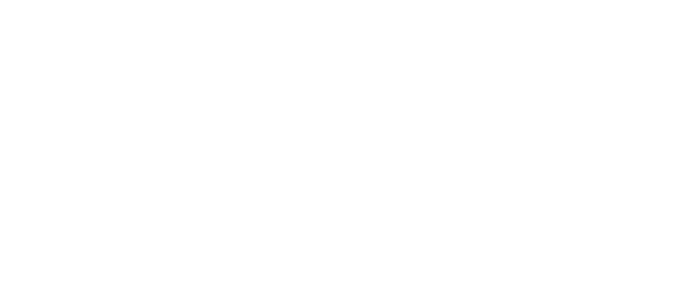

  <picture>
    <source srcset="assets/logo-white.png" media="(prefers-color-scheme: dark)">
    <source srcset="assets/logo-dark.png" media="(prefers-color-scheme: light)">
    
  </picture>

### About me

- 💻 I'm curious to experiment new stacks and framework
- ☁️  I am developping web applications

### Tech Stack that I've already met

### 📝 Blog & Website

- 📰 [Visit my blog](https://blog.mattkds.dev/tech) – Dev notes, tips & more  
- 🌐 [Check out my website](https://mattkds.dev) – Portfolio, résumé, projects  

## Connect with me  

<a href="https://github.com/mattkds" target="_blank">

<!--
**mattkds/mattkds** is a ✨ _special_ ✨ repository because its `README.md` (this file) appears on your GitHub profile.

Here are some ideas to get you started:

- 🔭 I’m currently working on ...
- 🌱 I’m currently learning ...
- 👯 I’m looking to collaborate on ...
- 🤔 I’m looking for help with ...
- 💬 Ask me about ...
- 📫 How to reach me: ...
- 😄 Pronouns: ...
- ⚡ Fun fact: ...
-->

  
